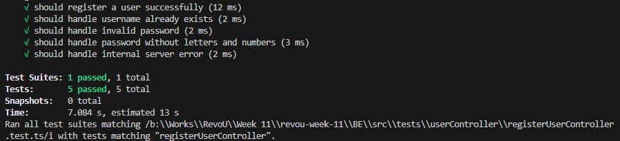
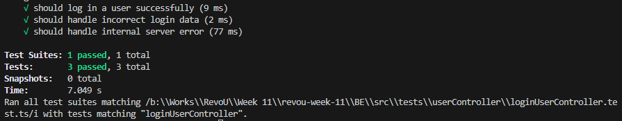
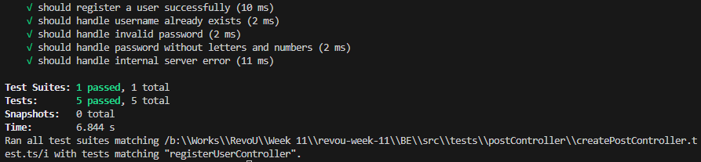
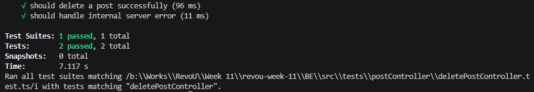
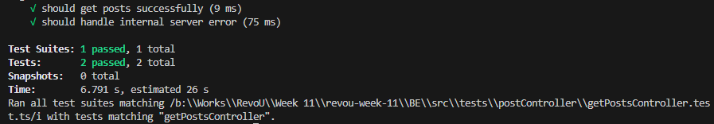
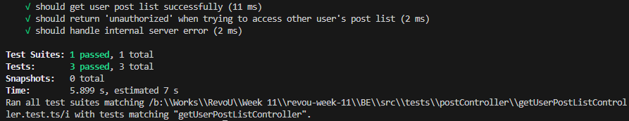
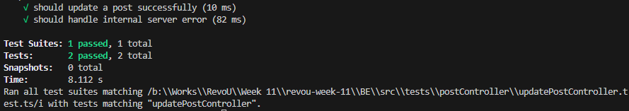

# RevoU Week 11 Assignment - Milestone Project 2

Creates simple Blog application using ExpressJs, Typescript, Swagger, Bootstrap, and DOM, also connects it with MySQL database... **in 4 days**....

## Assignment Information

1. Back-end is written using Typescript, ExpressJS, and NodeJS.

2. Back-end and Database is deployed at Railway.app.

3. Database used is MySQL and Sequelize.

4. Front-end is written using HTML, CSS, javascript (for styling), Bootstrap, and Typescript (for scripting).

## Advanced Information - Back-End

1. There's 2 role, user and admin.

2. User can create, update, delete, and view other blog posts, while admin can only view blogpost and delete posts.

3. Admin status can only be given by SuperUser (in this case, me), by editing it directly from Database.

4. If user accessed invalid API Endpoint, it will be blocked and instead return HTTP 404.

5. After any query, database connection is closed automatically using Sequelize.

6. When connection successfully established, it will be shown on Console.
   
   

## Deploy Link

Back-end: [https://adriantori-w11-be.up.railway.app/api/v1](https://adriantori-w11-be.up.railway.app/api/v1)

API Documentation: [Swagger UI](https://adriantori-w11-be.up.railway.app/api-docs)

Diagrams: [Milestone 2 Diagrams](https://viewer.diagrams.net/?tags=%7B%7D&highlight=0000ff&edit=_blank&layers=1&nav=1&title=Milestone%202#R7V1bd6JIEP41PprD%2FfJolGSco9GJOjvztIcIUWbQNoBJ3F%2B%2FjYAiXSImLbf4lNg02FTV13XpqrLBtxfv946%2BmveRYdoNjjHeG3ynwXEqxzD4jz%2ByCUYkWRaDkZljGcEYux8YWf%2BZ4WB442xtGaZ7MNFDyPas1eHgFC2X5tQ7GNMdB70dTntG9uG3rvSZSQyMprpNjv5jGd48GFVEZj%2F%2BzbRm8%2Bib2eiNF3o0ORxw57qB3mJDvNbg2w5CXvDf4r1t2j71IroE990dubpbmGMuvSw3TL8PJm27vbFm%2FW%2Fd7%2B1bb%2F00aUrBU151ex2%2BcLhYbxNRwDQwQcKPyPHmaIaWuq3tR28dtF4apv81DP60n9NDaIUHWTz4x%2FS8Tchdfe0hPDT3FnZ4lXyV8O1ctHamZsr6w%2BV6ujMzvZR5odD57xL7gpBQ9yZamJ6zwRMc09Y96%2FWQ%2BXooQ7PdvD2Z8T8hpc%2BgOgdQXbLx%2Bm%2BfEaZAnPzSyxpFF5ruloAtPAFT631LuOg6%2Fm%2Fm%2Fx2NW4%2Fj6Gl4ccEDg2sEa%2FeM87nwNrc8c7TStwR%2Fw3jOyKRX0%2FHM91SyhlebIiOHaAj3gyYvSuHI2x5eLB%2BOzWPQiu78DDeabz%2FUVa%2FZbr9wq1F%2FMpCsn%2FMmW3UQ8BlBwHKlQgFPkH34OGhro1Ekvk9OJLk9NLOWKeLLnBbfZ8u228hGzvZe3mQN0ZTxuOs56K8Zu6JKMq9LlAReUEQxIfASJPAcIPASBYEHCS9XXN7FjPLOl0rcxezi%2FmjOLNcznSpKvMhIhUo8uMVH5lplRT4yh%2BMyD76poJZK6FmS8EMHTU3XJaV%2BOBhhy4VpO6bumUPkeuSUhJk03cnw3gziGUaYqippGU1cH1DnGkbn4%2BxZmZrTKYSzJ0UURIaWZuEk7iaJNJktGmls1ZVLZCSdRBpbLp8iWneM8IPJeDgZkyj6%2Fo%2BPszEWTtKmwl7qyv8Xk063bdNGM0df4HtWpmPhhZpO8tpwf%2BE0UN7NyMUvlUkG%2BiC5wkYSqgMbGA0ZUSMVZpSlLTuLerrXfNS0bPtSqonxXwV%2Fg7HwfZ1jz6%2BH6iKjAGLRCISCMlVCoJQVgWypEEgGX44biL4yYyYr42offtA%2BVLkcFd1g3e6PBnrv1w%2B9bb88GX8mr4MmVyH7EJRXhYQZ%2FKJSqWCmZIdZR%2BtpY81HGkbEFWcfwZmSJ85AfstCEbDCdHQ2v%2Fz7MUnCj7%2Fj1zrv4cODT5vw0yfszqyBEUkuFR7PCYzsALk1Dekj8sDirAckk%2FalIBYNSI5k%2BMOgWqqPBQLv8EQlI9ZCjjE3HMOEdkBm%2BIVPGyJrK%2FHRFPT87OLFJdm1%2B9JPcJB0FuvKv8KCyHBMm4TOb20E0r6nP5n2Ib1025ot8f9TTK9tlMrfSaypbrfCCwvLMALWmK71n%2F60fZ7PnJUvWtuXEW8bYgekfbqkJPesXZ5K%2BC2NeCoIjAxGilR5tJmxZQcKSx51de%2B6bqhmkvpkjhZPa%2FdsXZJXtFCSiWihTOoSBVAlyqV8qIi%2BRdl2ccsuZujRt%2B0AXwucyFMPxW9vbTmOvolNCPcDElI7YRGFpOERnX3enXGPojIJGQlW8lGQwkIkXYXoUMtwtRIiORchkq9CdKj567UTSUoeQqRchQg6lKqJDImhdqYlQ4xnbIy7nvZ39uPbv%2BLPNjuY280vLEIgPYQ6iZDAsHRF6Of999%2FNnsV540lfa2qP7rI%2FbH5hewikR71EiBXpilAqbWOOb5i5zLTwOzLB0QfFgGpuTrBK5HSqRQdUhaqfJEZRttOeCfWjxI9CkU1CUWBPQvHUPZcxKrmCz78Ot3P5gvt5Vikqi1UpqIRA8KeEiLxH5OgKUWv0Ml6Li2%2F9F%2Bext%2Bw%2FotVftlkqGcpXhEB6UM%2Fd%2B6AISXxSHfE8XXFIpdMx9X4kwF1J%2FV6CA9Oq63cua51SpCFLctzGAcc3D2AiuW%2FPdg0gUQ%2B53tjyMAPAS7fI2BCszDPxnApmBCLJQOYBzAi77KA4anZl4tS5x1cdNnzWU%2BpyJdjxVFDzddEkAtmqEJ4gHUTjpBX2vEimVgtM0aHWSTBlzdjJKeODowWmOuKi%2BOxSgQx0VQwXWaslSmabCWS5xFcFRglzPKPEoMqgIGvsqGTJ0wLpiB%2Brdf2QsdU9YWwlr1hux7QxFoygOc9dqzfSyFnjbl8bjVv9YfXBx6gyWXu%2B93TiABRl0P%2BJnEz69WRqtTAYleNVDYPRusuCwVqhC%2FKFMhbIqhdTboWYePlXFElAO61KAJLsp3UFJB1A7qJ1%2B%2BMnBbA1oa51F4OjRMb5tIcOQevcW%2FzxCtHiL9euNOBpMGkvltZIANcvkFsSOK%2BwKA58Bl%2BhrlufIntx9VJpy04j%2B4mNQHdXQTPd7XbaKKyQU0n2kuNUwMkHq28uV34DxYTP697Kc0e6t3YfOtqvrJW4mIreIdsOubFESzPBunAoe0kcJCeHgKTCZ5noGcgwJJ8lgM38pbgM9CWpY7tGQU6m1nBq4eqaNG1q2BlWVpJ7m5xnTqV1z%2FffX%2F%2B8%2F2Xv2e7SQAP0INcwjT7NTIrrdZAchXX4S1t1DdQ6kRNaBrUONFCse6vSvLY6Mek%2F56tjQGxHC6iKL8ICYalUOc5%2F14LpzBZB51jYUGIOAofMjSrLJzTL9lMs6PRJdQOxDqRVYQHF1GWXojlmEe0w89oeo%2Fz3gixBmPlQECEgubvSl5%2Fycvut7kOMf8Hz6u%2FkCkQlTOFOLpDRXlWbUpGJQzNOBGDEqcBx9G6QfgyUPCatf5%2B3%2FDp5kzwX8uzlDbP8DEfiqjcpsx9qzpQz%2B0mziZrmbHX6X1J1SskzRU4CcsNzVZ1cIbGyo9Q86YTQ70cc3pqszuMVws7ZHQBHjwk8ofDOBCNoFP%2BSwftjqRCJ1L3x40Qj%2BFq5fAUoPS%2FXpHGwerSQBhuZAAMut%2Fx5eWnLPsvevNWXsLVAoaKVikCTDX35PM08kNBnWHnVIbTMEjtHviYVSOoKVWGl1c2frK%2Bn3qLhU1Qn7dhrqUkRuw%2FY4Ivc5ksLCXD9HAkJcF5hR7Bpq87u2a%2FDn9DoWVU9I8SuvGIIkDOvcE%2B8RM2ZB35GQ2CEjEnvF4MZ5MtXCWZABmOaYJcEZuTZQ4rmedAXZg10jACIv5hR%2FGnkRICMKKS978elPXPniMJctrRl51u4ESvPSF7SOl1fd0VeS9WhxSgJ801gsno0bDJw9RGeg901K2S%2FgesH7DdwXmH2W9qqs9tvd%2BtLH81Qtd0oWWLsDZfURaySoykG8q5CplhaP92TiCnMFEtb9WlTbIVR8q9VB29fgMRfzdEUAxlRXlMsbd8vsSmWtuyMpljgelyraDPaYbJyk%2FwxJYHLmghMxRRLy%2FKvQQ4UK5HR%2B3wz60ECk6ex9FIJf%2BOrw8fBXbenNb5eXsQOKakphRwDsPtyOYVk1W%2FdftGbznaY5B1X%2FK9zs6RbWvefic4rWY1NHiLly%2B60eoOrO5zGOJ5kXPHFS4V0pj9Kzrg3AK83c%2FFSYe0WU9f9lQ788toQGaL%2BWbkgrvBHB%2Fn03F27x4SY95Hh%2F16w9j8%3D)

## API Endpoint

Base URL : adriantori-w11-be.up.railway.app/

| HTTP Request | URL Endpoint     | Explanation                                                                                                                                |
| ------------ | ---------------- | ------------------------------------------------------------------------------------------------------------------------------------------ |
| POST         | /api/v1/register | Register new user, by default it have 'user' role                                                                                          |
| POST         | /api/v1/login    | Login user and generate JWT Token                                                                                                          |
| POST         | /api/v1/posts    | Create new post, can be accessed by 'user' role.                                                                                           |
| GET          | /api/v1/posts    | Get all posts, can be accessed by 'user' and 'admin' role.                                                                                 |
| PATCH        | /api/v1/posts    | Update Title and Body of the post, can only be accessed by 'user' who creates the post.                                                    |
| DELETE       | /api/v1/posts    | Soft-delete the post, can only be accessed by 'admin' role. Post wont be permanently deleted, instead will be flagged as IsDeleted = true. |
| GET          | /api-docs        | Returns Swagger UI documentation                                                                                                           |

## API Request and Response

All of error response are handled by back-end and moved through Error line to both back-end call and front-end alert box.

### Users:

#### POST /api/v1/register

Response:

```json
{
    "username":"string",
    "password":"string"
}
```

Response:

```json
{
    "message": "Error || Successfully registered"
}
```

#### POST /api/v1/login

Request:

```json
{
    "username":"string",
    "password":"string"
}
```

Response:

```json
{
    "message": "Error || Successfully registered"
}
```

### Posts:

#### POST /api/v1/posts

Request:

```json
{
    "postTitle":"string <255>",
    "postBody":"string <511>"
}
```

Response:

```json
{
    "message": "Error || Post successful"
}
```

### GET /api/v1/posts

 Response:

```json
{
    "message": "Error || Get all posts"
}
```

#### PATCH /api/v1/posts

Request:

```json
{
    "postTitle":"string <255>",
    "postBody":"string <511>"
}
```

Response:

```json
{
    "message": "Error || Post updated"
}
```

##### DELETE /api/v1/posts

Request:

```json
{
    "postId": <number>
}
```

Response:

```json
{
    "message": "Error || Post deleted"
}
```

## Advanced Information - Database

in this section, I will explain about Table definition, how to use it, and how Redis works.

### MySQL Database Table Definition:

#### Role table

| Column    | Type                  |
| --------- | --------------------- |
| role_id   | INT Auto_increment PK |
| role_name | VARCHAR(20)           |

```sql
CREATE TABLE `roles` (
  `role_id` int NOT NULL AUTO_INCREMENT,
  `role_name` enum('user','admin') NOT NULL,
  PRIMARY KEY (`role_id`)
) ENGINE=InnoDB AUTO_INCREMENT=3 DEFAULT CHARSET=utf8mb4 COLLATE=utf8mb4_0900_ai_ci;
```

#### Users table

| Column    | Type                  |
| --------- | --------------------- |
| user_id   | INT Auto_increment PK |
| user_name | VARCHAR(70)           |
| user_pass | VARCHAR(80)           |
| role_id   | INT FK_role_table     |

```sql
CREATE TABLE `users` (
  `user_id` int NOT NULL AUTO_INCREMENT,
  `user_name` varchar(70) NOT NULL,
  `user_pass` varchar(80) NOT NULL,
  `role_id` int DEFAULT NULL,
  PRIMARY KEY (`user_id`),
  UNIQUE KEY `users_un` (`user_name`),
  KEY `usertable_FK` (`role_id`),
  CONSTRAINT `usertable_FK` FOREIGN KEY (`role_id`) REFERENCES `roles` (`role_id`)
) ENGINE=InnoDB AUTO_INCREMENT=38 DEFAULT CHARSET=utf8mb4 COLLATE=utf8mb4_0900_ai_ci;
```

#### Posts table

| Column         | Type                     |
| -------------- | ------------------------ |
| post_id        | INT Auto_increment PK    |
| post_content   | VARCHAR(100)             |
| user_id        | INT FK_users_table       |
| createdAt      | TIMESTAMP                |
| UpdatedAt      | TIMESTAMP                |
| post_isDeleted | TINYINT(1) [true, false] |

```sql
CREATE TABLE `posts` (
  `post_id` int NOT NULL AUTO_INCREMENT,
  `post_title` varchar(255) NOT NULL,
  `post_content` varchar(511) DEFAULT NULL,
  `user_id` int DEFAULT NULL,
  `createdAt` timestamp NULL DEFAULT NULL,
  `updatedAt` timestamp NULL DEFAULT NULL,
  `post_isDeleted` tinyint(1) NOT NULL DEFAULT '0',
  PRIMARY KEY (`post_id`),
  KEY `posttable_FK` (`user_id`),
  CONSTRAINT `posttable_FK` FOREIGN KEY (`user_id`) REFERENCES `users` (`user_id`)
) ENGINE=InnoDB AUTO_INCREMENT=3 DEFAULT CHARSET=utf8mb4 COLLATE=utf8mb4_0900_ai_ci;
```

## Validation

There's only 2 validation in the entire app, Register has minimum 8 characters and alphanumeric, and Post title and Post Body cant be empty.

## Unit Testing

In this section, I will post all the Jest unit testing, both Postitive and Negative case. All of it are generated by ChatGPT and tweaked manually according to requirements. It has 100% code coverage.

### registerUserController.test.ts:

### 

### loginUserController.test.ts



### createPostController.test.ts



### deletePostController.test.ts



### getPostController.test.ts



### getUserPostListController.test.ts



### updatePostController.test.ts

 

## Front-end - Simple Explanation

Due to the length of this README.md, I'll just explain the front-end very shortly.

### Index.html

Contains Register & Login module

### Main.html

Contains GET AllPost, CreatePost, FullPost. I used Modals to handle CreatePost and FullPost (when a post is clicked).

### MyProfile.html

Contains GET UserPostList, which handles all post made by the logged in user. There's also DELETE UserPost and PUT UpdatePost button on each page. If DELETE button clicked, there will be confirmation before the post gets deleted. If UPDATE button clicked, it will open Modals that have PostTitle and PostBody.

### AdminPage.html

Contains GET AllPost, similar to Main.html. Although, every post will have DELETE button in which Admin can delete any posts.
